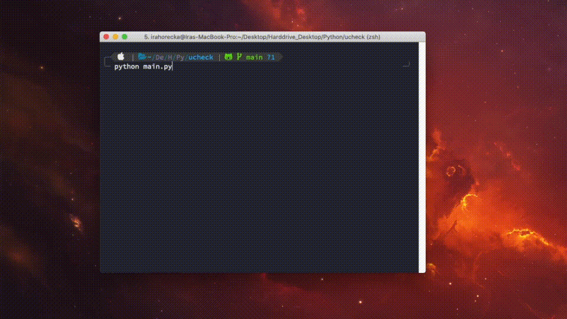

# ucheck

[](https://pypi.python.org/pypi/ucheck)
[](https://img.shields.io/pypi/pyversions/ucheck)

Autosubmit your UCheck COVID-19 self-assessment form

<p align="center">
    
</p>

## Disclaimer

* ucheck automatically completes the University of Tornto's UCheck COVID-19 self-assessment form as follows:
  * **YES**: "Do any of the following statements apply to you? - I am fully vaccinated against COVID-19."
  * **NO**: "The symptoms listed here are the most commonly associated with COVID-19. Are you currently experiencing any of these symptoms?"
  * **NO**: "In the last 10 days, has someone in your household experienced any COVID-19 symptoms and/or tested positive for COVID-19 (on a rapid antigen test or PCR test)?"
  * **NO**: "In the last 14 days, have you travelled outside of Canada and been told to quarantine per the federal quarantine requirements?"
  * **NO**: "In the last 10 days, have you been identified as a "close contact" of someone who currently has COVID-19 (confirmed by a PCR or rapid antigen test)?"
  * **NO**: "In the last 10 days, have you received a COVID Alert exposure notification on your cell phone?"
  * **NO**: "In the last 10 days, have you tested positive on a rapid antigen test or home-based self-testing kit?"
* If you do not satisfy these questions as listed, DO NOT use this library to complete your UCheck form. If you're interested in making these choices customizable, please raise an issue using the [issues tracker](https://github.com/irahorecka/ucheck/issues).

## Installation

```bash
pip install ucheck
```

## Requirements and setup

This library uses [Selenium](https://selenium-python.readthedocs.io/) to complete the UCheck form. If you're new to Selenium, it takes ~5 minutes to download and set up your browser driver. View how to [download and configure a browser driver](https://www.selenium.dev/documentation/getting_started/installing_browser_drivers/). If you're on macOS and hit permission issues, check out this [Stackoverflow article](https://stackoverflow.com/questions/60362018/macos-catalinav-10-15-3-error-chromedriver-cannot-be-opened-because-the-de).

## ucheck is simple to use

```python
import os
import time

from selenium.webdriver import Chrome
from selenium.webdriver.chrome.service import Service
from ucheck import UCheck

if __name__ == "__main__":
    # E.g., Save UTORid login and password as environment variables.
    utorid_login = os.environ["UTORID_USER"]
    utorid_pass = os.environ["UTORID_PASS"]
    with UCheck(Chrome, Service, driver_path="/opt/WebDriver/bin/chromedriver") as ucheck:
        ucheck.complete_ucheck(utorid_login, utorid_pass)
        # Briefly keep browser window open before closing.
        time.sleep(5)
```

## Set up a Cron job to execute ucheck

Here's an option to fully automate your Ucheck form submission. If you're on a *NIX computer, add the following lines to your cron configuration file:

```bash
SHELL=/bin/bash
0 8 * * * source /path/to/ucheck_script/venv/bin/activate && DISPLAY=:0 python /path/to/ucheck_script/main.py
```

What the Cron job is doing:

1. Everyday at 8 am
2. Activate virtual environment to execute `ucheck_script/main.py`
3. Execute `ucheck_script/main.py`, where `main.py` is the demo Python script posted above

You can find more information about setting up a Cron job [here](https://askubuntu.com/questions/2368/how-do-i-set-up-a-cron-job).

## Exceptions

Valid UTORid credentials are required to complete your UCheck form.

```python
import os

from selenium.webdriver import Chrome
from selenium.webdriver.chrome.service import Service
from ucheck import UCheck
from ucheck.exceptions import InvalidUTORidLogin

if __name__ == "__main__":
    # Set invalid user login credentials.
    utorid_login = "invalid-login"
    utorid_pass = os.environ["UTORID_PASS"]
    with UCheck(Chrome, Service, driver_path="/opt/WebDriver/bin/chromedriver") as ucheck:
        try:
            ucheck.complete_ucheck(utorid_login, utorid_pass)
        except InvalidUTORidLogin as e:
            print(e)
```

## Contribute

* [Issues Tracker](https://github.com/irahorecka/ucheck/issues)
* [Source Code](https://github.com/irahorecka/ucheck/tree/master/ucheck)

## Support

If you are having issues or would like to propose a new feature, please use the [issues tracker](https://github.com/irahorecka/ucheck/issues).

## License

The project is licensed under the MIT license.
